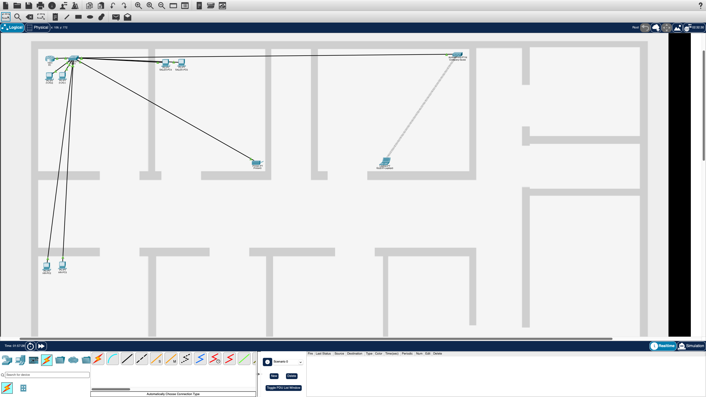
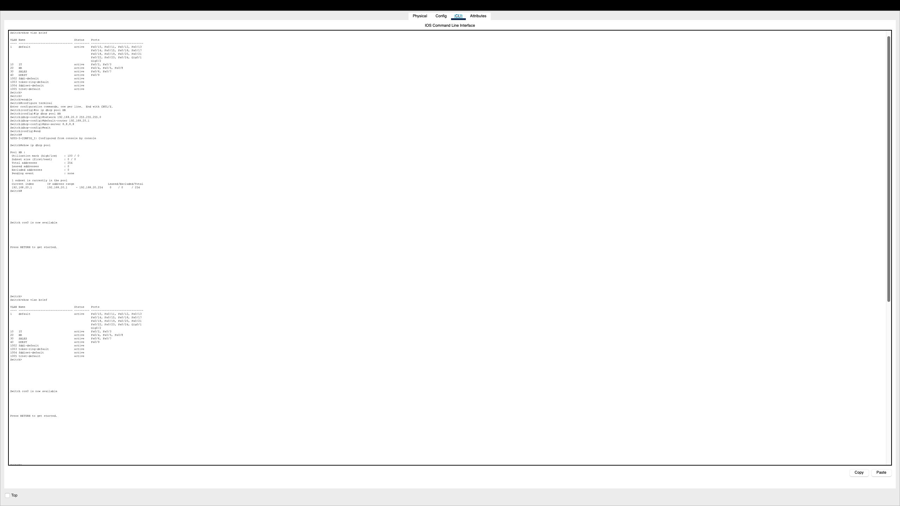
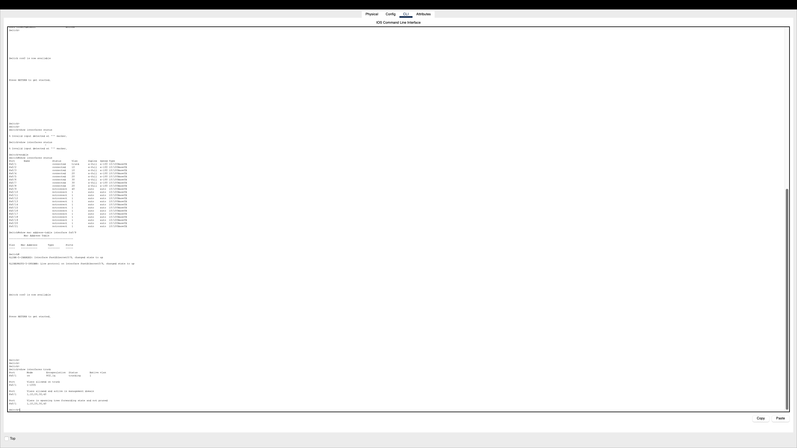
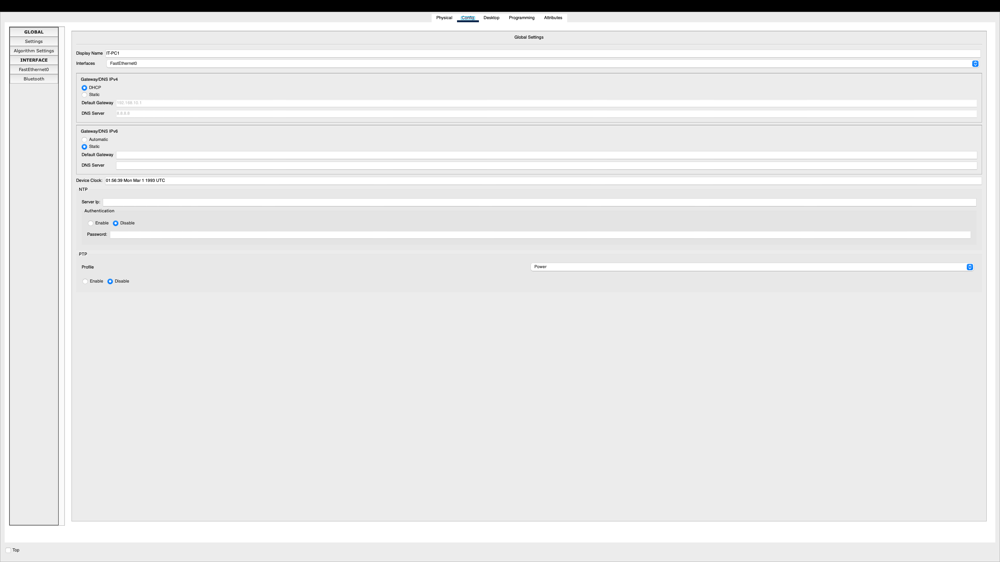
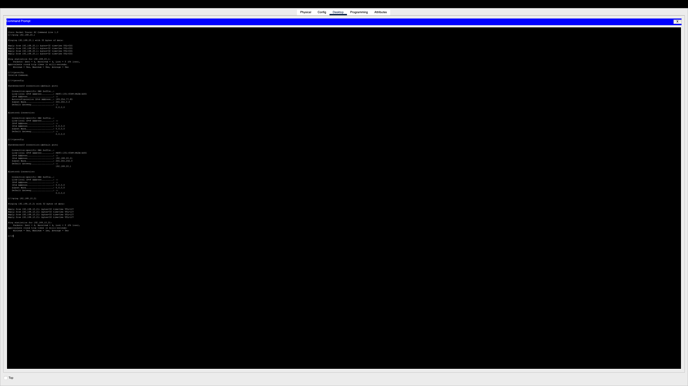

# Small Business Network - Cisco Packet Tracer

## Project Overview

This project demonstrates the design and configuration of a small business network using Cisco Packet Tracer.

The network is segmented into multiple departments using VLANs and supports DHCP, inter-VLAN routing, guest wireless access, network printer connectivity, and basic troubleshooting.

The goal of this project was to build a practical networking lab and apply core IT support and networking concepts in a realistic small business environment.

## Network Topology

The network includes:

- 1 Cisco Router
- 1 Cisco Switch
- 6 PCs
- 1 Network Printer
- 1 Wireless Access Point
- 1 Guest Laptop

## VLAN Design

The network is divided into four VLANs:

| Department | VLAN | Network | Default Gateway |
|---|---:|---|---|
| IT | 10 | 192.168.10.0/24 | 192.168.10.1 |
| HR | 20 | 192.168.20.0/24 | 192.168.20.1 |
| Sales | 30 | 192.168.30.0/24 | 192.168.30.1 |
| Guest | 40 | 192.168.40.0/24 | 192.168.40.1 |

## Trunk Configuration

The connection between the switch and router is configured as an 802.1Q trunk.

The trunk carries traffic for VLANs 10, 20, 30, and 40.

## Inter-VLAN Routing

Router-on-a-stick was configured using router subinterfaces.

Each VLAN has its own gateway:

- VLAN 10 - 192.168.10.1
- VLAN 20 - 192.168.20.1
- VLAN 30 - 192.168.30.1
- VLAN 40 - 192.168.40.1

## DHCP Configuration

The router provides DHCP services for the internal VLANs and the guest network.

Clients automatically receive:

- IPv4 address
- Subnet mask
- Default gateway
- DNS server

## Inter-VLAN Connectivity Test

Connectivity between different VLANs was tested using ICMP ping.

A successful ping between hosts in different VLANs confirms that inter-VLAN routing is functioning correctly.

## Network Printer

A network printer was configured with a static IP address:

- IP Address: 192.168.20.50
- Subnet Mask: 255.255.255.0
- Default Gateway: 192.168.20.1

The printer can be accessed by devices on the internal network.

## Guest Wireless Network

A dedicated guest wireless network was configured using VLAN 40.

The wireless access point provides connectivity to guest devices while keeping guest traffic separated from the internal department VLANs.

## Troubleshooting

During the project, several configuration issues were identified and resolved, including:

- DHCP address assignment failures
- Incorrect or missing DHCP pools
- Wireless access point connectivity issues
- VLAN port assignment verification
- Trunk interface verification
- Gateway connectivity testing

Static IP addressing and ICMP ping tests were used to isolate networking issues and confirm Layer 2 and Layer 3 connectivity.

## Technologies and Concepts Used

- Cisco Packet Tracer
- TCP/IP
- IPv4 Addressing
- VLANs
- 802.1Q Trunking
- Router-on-a-Stick
- DHCP
- Inter-VLAN Routing
- Wireless Networking
- Network Printer Configuration
- ICMP
- Network Troubleshooting

## Files

- `small-business-network.pkt` - Cisco Packet Tracer project file
- `01-network-topology.png`
- `02-vlan-configuration.png`
- `03-trunk-configuration.png`
- `04-router-subinterfaces.png`
- `05-dhcp-client.png`
- `06-inter-vlan-routing-test.png`

## What I Learned

This project helped me strengthen my understanding of:

- Network segmentation using VLANs
- DHCP configuration
- Inter-VLAN routing
- Router and switch configuration
- Wireless network setup
- TCP/IP troubleshooting
- Structured network troubleshooting methods
